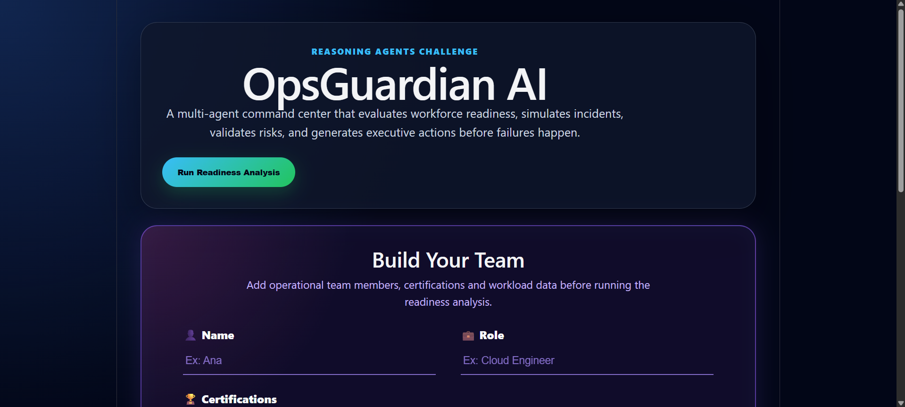
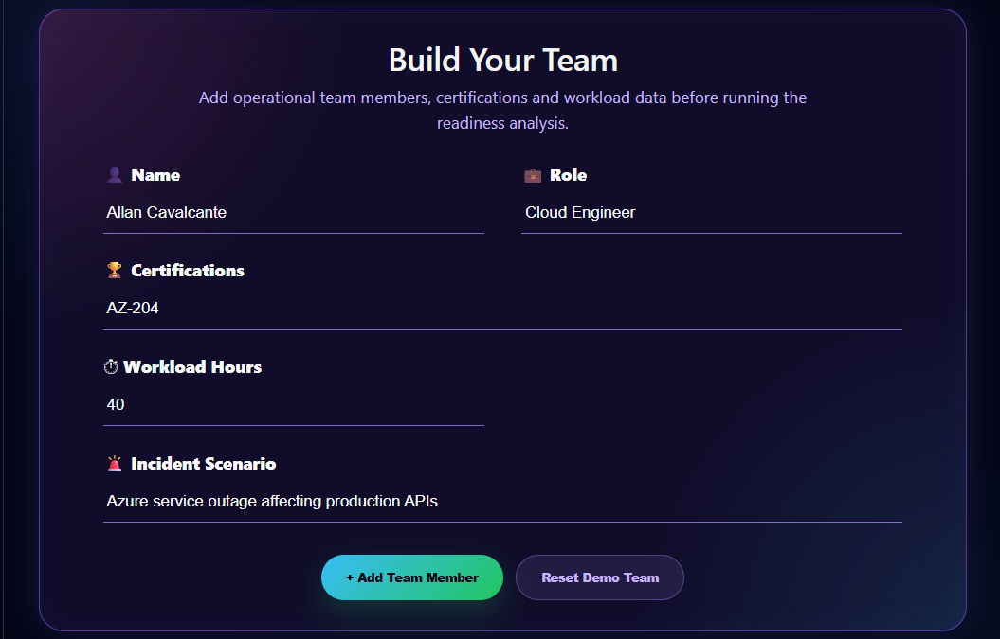
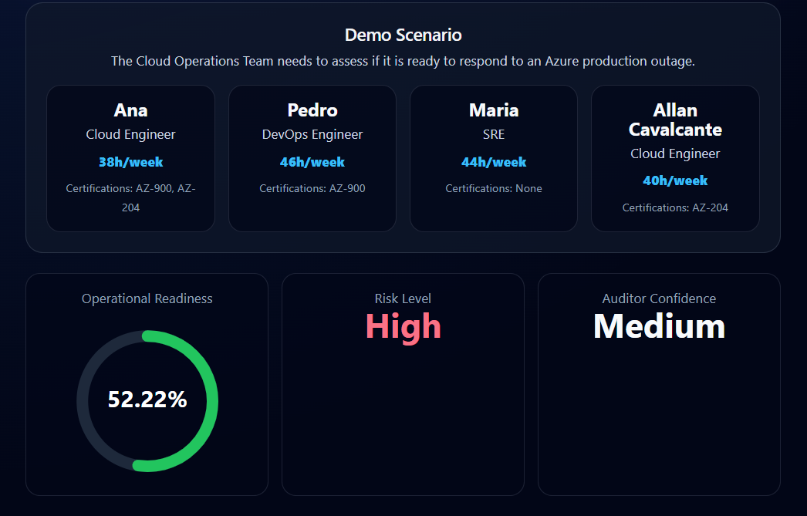
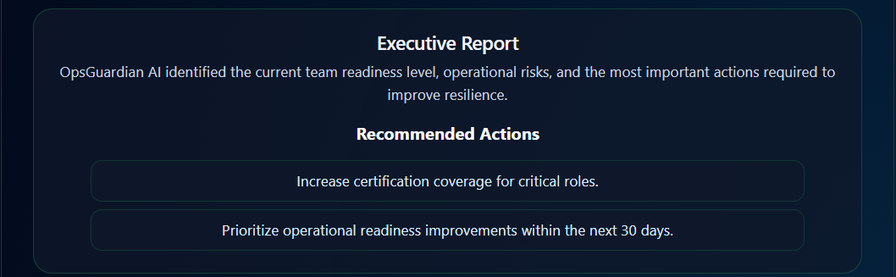

# OpsGuardian AI

# OpsGuardian AI


Multi-Agent Operational Readiness Platform built for the Microsoft Reasoning Agents Challenge.

OpsGuardian AI evaluates workforce readiness, validates operational risks, simulates incident response scenarios, and generates executive recommendations before critical failures happen.

---

## Live Demo

### Frontend Application

Azure Static Web App

https://lively-dune-0e978230f.7.azurestaticapps.net/

The frontend provides an interactive interface where users can:

* Build and manage operational teams
* Define incident scenarios
* Execute multi-agent readiness analysis
* Visualize operational readiness scores
* Review risk assessments
* Explore executive recommendations

### Backend API

Azure App Service

https://opsguardian-api-allan-ducha4a5gtgce2br.brazilsouth-01.azurewebsites.net/

### API Documentation (Swagger)

https://opsguardian-api-allan-ducha4a5gtgce2br.brazilsouth-01.azurewebsites.net/docs

The backend hosts the complete multi-agent reasoning engine responsible for:

* Skills Analysis
* Workload Assessment
* Incident Simulation
* Risk Assessment
* Auditor Validation
* Executive Insights Generation

---

## Application Screenshots

### Landing Page

The main dashboard introduces OpsGuardian AI and provides access to the readiness analysis workflow.



---

### Team Builder

Users can create operational teams, define certifications, workload information, and incident scenarios.



---

### Readiness Analysis Results

The platform evaluates workforce readiness, operational risk, and auditor confidence using the multi-agent reasoning pipeline.



---

### Executive Recommendations

The Executive Agent transforms technical findings into business-focused recommendations that support operational resilience and workforce improvement initiatives.



---

## Problem

Organizations often discover skill gaps, workload bottlenecks, and operational weaknesses only after a production incident occurs.

This creates:

* Slow incident response
* Knowledge silos
* Workforce overload
* Compliance risks
* Operational downtime

OpsGuardian AI proactively identifies these risks before incidents happen.

---

## Solution

OpsGuardian AI uses a multi-agent reasoning architecture to analyze operational readiness from different perspectives.

Each agent focuses on a specific domain.

### Skills Agent

Evaluates:

* Certifications
* Skill coverage
* Missing competencies
* Workforce readiness

### Workload Agent

Evaluates:

* Team capacity
* Workload distribution
* Availability risks
* Burnout indicators

### Incident Simulation Agent

Evaluates:

* Incident response capability
* Scenario preparedness
* Operational resilience

### Risk Assessment Agent

Combines all previous analyses and calculates:

* Operational readiness score
* Risk level
* Recommended actions

### Auditor Agent

Validates:

* Agent conclusions
* Consistency of evidence
* Confidence level

### Executive Insights Agent

Transforms technical findings into executive-level recommendations and operational improvement plans.

---

## Multi-Agent Architecture

OpsGuardian AI is built around a specialized multi-agent architecture where each agent is responsible for a specific operational readiness domain.

### Agent Responsibilities

| Agent | Responsibility |
| --- | --- |
| Skills Agent | Evaluates certifications, skill coverage, and workforce readiness. |
| Workload Agent | Assesses workload distribution, capacity, and burnout risks. |
| Incident Agent | Simulates incident response capability and preparedness. |
| Risk Agent | Calculates readiness scores and operational risk levels. |
| Auditor Agent | Validates evidence consistency and confidence levels. |
| Executive Agent | Generates executive recommendations and action plans. |
| Orchestrator Agent | Coordinates the complete multi-agent workflow. |         |

---

## Knowledge Base

OpsGuardian AI includes a synthetic operational knowledge base containing:

* Azure Certification Matrix
* Incident Response Policy
* Operational Readiness Guide

The system uses these documents as contextual evidence during analysis.

---

## Architecture

### Frontend

* React
* TypeScript
* Vite
* Axios

### Backend

* FastAPI
* Python 3.11
* Multi-Agent Architecture

### Cloud

* Azure App Service
* Azure Static Web Apps
* GitHub Actions CI/CD

---

## Cloud Infrastructure

### Azure Services Used

* Azure App Service
* Azure Static Web Apps
* GitHub Actions
* Azure Resource Groups

### Continuous Integration & Deployment

Every push to the main branch automatically triggers:

1. Frontend build and deployment
2. Backend build and deployment
3. Azure infrastructure update

This ensures rapid delivery and continuous deployment during development.

---

## Deployment Architecture

Frontend

↓

Azure Static Web Apps

↓

Backend API

↓

Azure App Service (Python + FastAPI)

↓

GitHub Actions CI/CD

↓

Microsoft Azure

---

## Workflow

1. User builds an operational team profile
2. User defines an incident scenario
3. Multi-agent analysis is executed
4. Agents generate independent findings
5. Auditor Agent validates reasoning
6. Executive report is generated

---

## Features

* Multi-Agent Reasoning
* Operational Readiness Scoring
* Risk Classification
* Workforce Analysis
* Certification Gap Detection
* Knowledge-Based Recommendations
* Auditor Validation Layer
* Azure Cloud Deployment
* Automated CI/CD Pipeline
* Executive Reporting Dashboard
* Interactive Team Builder
* Incident Scenario Simulation

---

## Local Development

### Backend

```bash
cd backend

pip install -r requirements.txt

uvicorn main:app --reload
```

Backend runs on:

```text
http://127.0.0.1:8000
```

### Frontend

```bash
cd frontend

npm install

npm run dev
```

Frontend runs on:

```text
http://localhost:5173
```

---

## Example Scenario

Cloud Operations Team must assess readiness to respond to an Azure production outage.

Expected outputs:

* Operational Readiness Score
* Risk Level
* Certification Gaps
* Workload Risks
* Executive Recommendations

---

## Future Enhancements

* Azure OpenAI integration
* Microsoft Fabric integration
* Real operational telemetry ingestion
* Dynamic knowledge retrieval (RAG)
* Predictive incident simulations
* Executive dashboard analytics
* Real-time workforce monitoring
* AI-assisted remediation planning

---

## Author

Allan Cavalcante

### GitHub

https://github.com/allan141

### Repository

https://github.com/allan141/OpsGuardian-AI

---

## Project Vision

OpsGuardian AI demonstrates how multi-agent reasoning systems can help organizations proactively identify operational risks, workforce gaps, and incident response weaknesses before they impact business operations.

By combining workforce analysis, incident simulation, risk assessment, knowledge-based reasoning, and executive reporting into a unified platform, OpsGuardian AI provides a practical example of how AI agents can support operational excellence in modern cloud environments.
